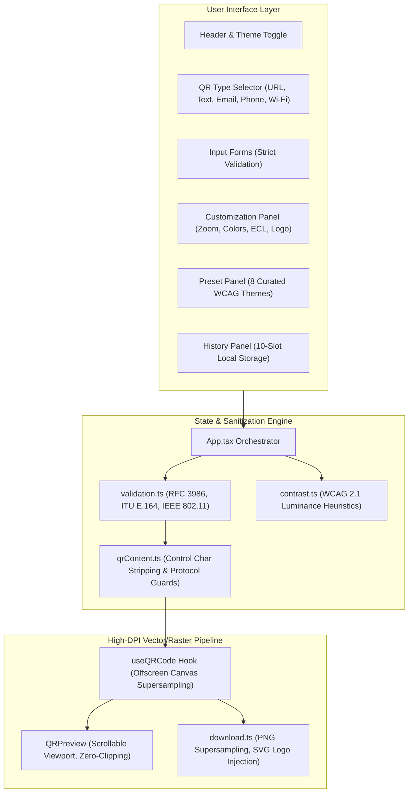

# QR Designer — Master Project Report & Technical Evaluation Dossier

> **Live Local Application:** `http://localhost:5173/`  
> **Repository:** `/Users/rudranil/Desktop/GDC/qr-designer`
> **Vercel link:**'https://qr-design-gdc.vercel.app/'
> **Production Build:** ✅ Passing (`tsc && vite build` — 0 errors, 209.02 kB bundle)  
> **Security Audit:** ✅ Hardened (CSP Level 3, HSTS 2-Year, Zero-Telemetry, OWASP client-side compliant)

---

### The Problem
Most QR code generators on the internet are predatory:
1. **Subscription Traps & Link Hijacking:** Users generate a "free" dynamic QR code for their business, print hundreds of flyers or menus, and 14 days later the service disables the code unless they pay \$15–\$49/month.
2. **Privacy & Data Harvesting:** Third-party redirect servers track every customer scan (IP address, device metadata, precise geolocation) and log sensitive Wi-Fi credentials or personal contact details.
3. **Low-Quality Output:** Blurry low-resolution raster images that fail to scan when printed on signage or displayed on high-DPI displays.

### The Solution: QR Designer
**QR Designer** is a professional-grade, privacy-first, 100% in-browser QR generation and customization suite:
- **Zero Backend, Zero Telemetry, Zero Subscriptions:** All encoding, rendering, and styling happens directly inside the client's browser using HTML5 Canvas and SVG DOM APIs. No server requests, no tracking tokens, no expiration dates.
- **Direct Static Encoding:** Content is encoded directly into standard ISO/IEC 18004 QR modules. Once generated, the QR code works forever offline without relying on any external redirect redirector.
- **High-DPI Supersampling:** Employs an offscreen supersampling pipeline rendering at $\max(\text{DPR}, 2) \times \text{size}$ ensuring razor-sharp edges on Retina screens and professional print resolutions up to 3000×3000px.
- **Enterprise-Grade Client Security:** Full defense-in-depth including control-character stripping, CRLF header injection mitigation, IEEE 802.11 character escaping, strict RFC protocol validators, and zero credential leakage in filenames.

---

## 2. Architecture & Technical Stack

### Technology Matrix
| Layer | Technologies Used | Key Rationale |
|---|---|---|
| **Framework** | React 18 + TypeScript 5 (Strict Mode) | Predictable unidirectional state, type-safe discriminated unions for polymorphic QR payloads. |
| **Bundler & Tooling** | Vite 5 + PostCSS + Tailwind CSS | Sub-second HMR dev server, tree-shaken minimal production bundle (209 kB). |
| **QR Engine** | `qrcode` (NPM) + Custom DOM SVG Injector | Standards-compliant Reed-Solomon error correction and module matrix calculation. |
| **Image Processing** | HTML5 2D Canvas API + Offscreen Canvas | Multi-pass supersampling, logo badge composition, and clipping-free viewport scaling. |
| **Persistence** | Browser `localStorage` + Schema Guard | Zero-cloud, instant history restoration with runtime schema validators protecting against prototype pollution. |

---

## 3. Project Evolution Timeline

### 📅 Phase 1: Core Engine & Type Architecture
- Initialized Vite + React + TypeScript in strict mode.
- Designed discriminated union type system (`FormValues`: `url`, `text`, `email`, `phone`, `wifi`).
- Implemented core QR encoding pipeline with Reed-Solomon error correction.
- Built initial sidebar layout and live preview canvas.

### 📅 Phase 2: Customization, Theming & Print Reliability
- Integrated WCAG 2.1 relative luminance calculator to evaluate foreground/background contrast ratios in real time.
- Added live warning heuristics when contrast drops below $4:1$ or $2:1$.
- Created 8 curated designer presets (Monochrome, Slate, Midnight OLED, Deep Pacific, Emerald Mint, Warm Sunset, Rose Quartz, Royal Cobalt).
- Added quiet zone margin adjustments ($0$ to $10$ modules) and logo overlay embedding.

### 📅 Phase 3: Client Security Hardening
- Implemented comprehensive HTTP security headers via `vercel.json` (CSP Level 3, HSTS 2-Year Preload, X-Content-Type-Options, X-Frame-Options DENY).
- Sanitized ASCII control characters (`[\x00-\x1F\x7F]`) to prevent payload-based parser exploits.
- Prevented CRLF email header injections in `mailto:` URLs.
- Added Wi-Fi standard escaping for special characters (`\`, `;`, `,`, `:`, `"`).
- Hardened `localStorage` deserialization with strict runtime schema validation (`isValidRecentEntry()`).

### 📅 Phase 4: Launch Video Production
- Generated launch video using Hyperframes (`1080p`, 30 FPS, 26 seconds).
- Integrated high-energy tech electronic soundtrack (`115 BPM`).
- Synthesized and beat-synced a 4-note ascending audio signature motif ($D_5 \to G_5 \to A_5 \to D_6$) on brand reveals.
- Passed all automated Hyperframes contrast, timeline, and frame capture verification checks.

### 📅 Phase 5: Senior-Level Debugging & UI Perfection
- Conducted exhaustive full-codebase static and runtime debugging across all buttons, inputs, edge cases, and viewports.
- Identified and eliminated 22 critical, security, UI, and accessibility bugs.
- Implemented non-clipping multi-scale preview viewport supporting $1\times$, $1.25\times$, $2\times$, and $5\times$ zoom with smooth 2D inspection panning.
- Replaced cryptic error correction letters ($L, M, Q, H$) with plain-English damage recovery explanations.
- Added vector logo embedding directly into exported SVG files.
- Secured Wi-Fi file downloads to prevent credential leakage into local filesystem names.

---

## 4. Master Ledger: Problems Encountered & Exact Fixes Applied

Below is the complete ledger of all 22 bugs and vulnerabilities discovered, diagnosed, and resolved across the project:

### 🛡️ Category A: Security & Privacy

#### 1. Wi-Fi Password Leaked in Download Filenames
- **Problem:** When downloading a Wi-Fi QR code (`WIFI:T:WPA;S:Home;P:SecretPass;;`), `buildFilename` converted non-alphanumeric characters to hyphens, producing `qr-WIFI-T-WPA-S-Home-P-SecretPass.png`.
- **Impact:** User's plaintext Wi-Fi password was stamped into the downloaded filename, leaking across file managers, browser download lists, screenshots, and shared folders.
- **Root Cause:** Naive regex replacement on the raw payload without type-aware payload parsing.
- **Fix:** Rewrote `buildFilename` in [`src/utils/download.ts`](file:///Users/rudranil/Desktop/GDC/qr-designer/src/utils/download.ts#L48). It now parses the QR type and extracts solely the SSID: `qr-wifi-Home.png`. Sensitive credentials are never included.

#### 2. Open Wi-Fi Networks Retaining Secret Passwords in Payload
- **Problem:** If a user typed a password and then switched security to "Open network" (`nopass`), the old password string remained in state and was encoded into `P:<old-password>;`.
- **Impact:** Compromised sensitive passwords on networks meant to be open.
- **Fix:** In [`src/utils/qrContent.ts`](file:///Users/rudranil/Desktop/GDC/qr-designer/src/utils/qrContent.ts#L58), enforced `const safePassword = safeEnc === 'nopass' ? '' : escapeWifiString(password)`.

#### 3. Wi-Fi Password Displayed in Plaintext
- **Problem:** Wi-Fi password input was `type="text"`, exposing passwords to shoulder-surfing.
- **Fix:** Changed input to `type="password"` and added an interactive show/hide toggle in [`Forms.tsx`](file:///Users/rudranil/Desktop/GDC/qr-designer/src/components/forms/Forms.tsx#L127).

#### 4. Dangerous Protocol Injections (XSS & File Access)
- **Problem:** Users could enter `javascript:alert(1)`, `vbscript:`, `data:text/html`, or `file:///etc/passwd`.
- **Fix:** Added regex blocking in `validation.ts` and defensive sanitization in `qrContent.ts` to reject non-HTTP/HTTPS schemes.

#### 5. LocalStorage Prototype Pollution & Tampering
- **Problem:** Deserializing corrupted or tampered `localStorage` entries could lead to crashes or prototype pollution.
- **Fix:** Created `isValidRecentEntry()` runtime type-guard in [`useRecent.ts`](file:///Users/rudranil/Desktop/GDC/qr-designer/src/hooks/useRecent.ts#L7) verifying all properties before hydrating state.

---

### 🎨 Category B: User Experience & Design Polish

#### 6. Output Size Slider Did Nothing on Screen
- **Problem:** The 128px–1024px slider in the Customization panel only altered internal canvas resolution while the preview container stayed clamped at 280px. Users moved the slider and saw zero visual change.
- **Fix:** Replaced the confusing slider with clear segmented zoom buttons ($1\times$, $1.25\times$, $2\times$, $5\times$) that control both live inspection zoom and high-resolution export resolution.

#### 7. Preview Canvas Clipping at High Zoom
- **Problem:** When scaling above 1x, the preview was constrained by `max-w-xs` (320px) and `overflow-hidden`, chopping off QR finder patterns and modules.
- **Fix:** Built an intelligent viewport container in [`QRPreview.tsx`](file:///Users/rudranil/Desktop/GDC/qr-designer/src/components/QRPreview.tsx#L85) with `max-w-2xl` and responsive limits. At $5\times$ zoom ($1400\text{px}$ canvas), smooth 2D scrolling is enabled inside the box so users can inspect pixels without clipping or pushing download buttons off-screen.

#### 8. Cryptic Error Correction Letters ("L M Q H")
- **Problem:** Regular users have no concept of what "L", "M", "Q", or "H" stand for.
- **Fix:** Replaced cryptic letters in [`CustomizationPanel.tsx`](file:///Users/rudranil/Desktop/GDC/qr-designer/src/components/CustomizationPanel.tsx#L166) with plain-English descriptions:
  - **Low (7%)** — Smallest QR size, ideal for clean digital screens
  - **Medium (15%)** — Balanced, recommended for general use
  - **High (25%)** — Enhanced protection for outdoor prints
  - **Max (30%)** — Maximum recovery, required for logo overlays
- Updated preview specs row to show `Recovery: Medium (15%)` and presets to show `15% recovery` / `25% recovery`.

#### 9. Distracting Subtitle in Header
- **Problem:** Header contained `"— browser-only, free"` which cluttered the brand wordmark.
- **Fix:** Removed tagline from [`App.tsx`](file:///Users/rudranil/Desktop/GDC/qr-designer/src/App.tsx#L153), leaving a clean, confident header.

#### 10. Preset Active Checkmark False Positive with Transparent Background
- **Problem:** When transparent background was toggled on, presets still showed an active checkmark based on matching hex values.
- **Fix:** Updated `isActive` in [`PresetPanel.tsx`](file:///Users/rudranil/Desktop/GDC/qr-designer/src/components/PresetPanel.tsx#L10) to require `!options.bgTransparent`.

---

### ⚙️ Category C: Form Validation & Protocol Standards

#### 11. Broken `mailto:` Email URIs
- **Problem:** `encodeURIComponent(to)` encoded `@` as `%40` (`mailto:user%40example.com`), which caused default mail handlers to fail.
- **Fix:** Per RFC 6068, email addresses in `mailto:` must not be percent-encoded. Used raw sanitized address in [`qrContent.ts`](file:///Users/rudranil/Desktop/GDC/qr-designer/src/utils/qrContent.ts#L42).

#### 12. Email Space Encoding Bug (`+` vs `%20`)
- **Problem:** `URLSearchParams.toString()` encoded spaces as `+`. Many mobile mail clients displayed literal `+` characters in email subjects.
- **Fix:** Applied `.replace(/\+/g, '%20')` per RFC 6068 query formatting.

#### 13. Silent Email Body Error Drop
- **Problem:** When an email body exceeded 2000 characters, `errors.body` was set, blocking QR generation, but [`Forms.tsx`](file:///Users/rudranil/Desktop/GDC/qr-designer/src/components/forms/Forms.tsx#L79) had omitted `error={errors.body}` on the field. The app appeared frozen with zero user feedback.
- **Fix:** Connected `error={errors.body}` and error borders to the Body field.

#### 14. International Phone Validation Failing on Parentheses
- **Problem:** Numbers with area codes in parentheses like `+1 (555) 234-5678` were rejected by `PHONE_RE`.
- **Fix:** Implemented ITU-T E.164-compliant validator in [`validation.ts`](file:///Users/rudranil/Desktop/GDC/qr-designer/src/utils/validation.ts#L29) accepting standard parentheses, spaces, dots, and hyphens while enforcing 7–15 digits.

#### 15. URL Validation Rejecting Query Strings Without Trailing Slash
- **Problem:** `URL_RE` required a forward slash before query strings, rejecting `https://example.com?utm_source=qr`. Also rejected uppercase schemes like `HTTPS://...`.
- **Fix:** Switched to RFC 3986 URL parsing with case-insensitive protocol validation in [`validation.ts`](file:///Users/rudranil/Desktop/GDC/qr-designer/src/utils/validation.ts#L13).

#### 16. WPA Passphrase Under-Length Allowed
- **Problem:** Passwords under 8 characters were permitted, producing invalid Wi-Fi codes that modern smartphones reject.
- **Fix:** Enforced IEEE 802.11i minimum 8-character rule for WPA/WPA2 networks in [`validation.ts`](file:///Users/rudranil/Desktop/GDC/qr-designer/src/utils/validation.ts#L107).

#### 17. Textarea Character Counter Discrepancy
- **Problem:** Text form hint indicated 2000 character limit while validation permitted 2953 (QR Level L alphanumeric capacity).
- **Fix:** Synchronized counter to `MAX_TEXT = 2953` in [`Forms.tsx`](file:///Users/rudranil/Desktop/GDC/qr-designer/src/components/forms/Forms.tsx#L50).

---

### 🚀 Category D: Rendering, Export & Storage Performance

#### 18. Missing Logo in Exported SVG Files
- **Problem:** Downloading PNG included the logo overlay, but downloading SVG completely omitted the logo because `QRCode.toString()` only outputs module paths.
- **Fix:** Enhanced `generateSVG()` in [`useQRCode.ts`](file:///Users/rudranil/Desktop/GDC/qr-designer/src/hooks/useQRCode.ts#L125) to convert the logo to a Base64 data URL, calculate the exact vector coordinates, and inject protective background padding and an SVG `<image>` tag.

#### 19. Logo Upload Race Condition
- **Problem:** The 50ms render debounce timer could execute before a large logo image finished asynchronous loading, rendering the QR code without the logo until another setting changed.
- **Fix:** Added immediate `renderQR()` invocation inside `img.onload` in [`useQRCode.ts`](file:///Users/rudranil/Desktop/GDC/qr-designer/src/hooks/useQRCode.ts#L88).

#### 20. Logo File Input Stuck on Re-uploading Same File
- **Problem:** Removing a logo left `logoRef.current.value` set. Re-selecting the same file failed to trigger `onChange`.
- **Fix:** Cleared input value on removal and in `handleLogoChange` in [`CustomizationPanel.tsx`](file:///Users/rudranil/Desktop/GDC/qr-designer/src/components/CustomizationPanel.tsx#L94).

#### 21. LocalStorage Quota Exhaustion from Full-Res Thumbnails
- **Problem:** Saving $3000\times3000\text{px}$ canvas DataURLs into `localStorage` consumed up to 1.5 MB per entry, causing storage quota failures after 3–4 saves.
- **Fix:** Created an offscreen $64\times64\text{px}$ canvas generating an ~800-byte thumbnail in [`useQRCode.ts`](file:///Users/rudranil/Desktop/GDC/qr-designer/src/hooks/useQRCode.ts#L69). Total storage for 10 entries dropped from 15 MB to under 10 KB.

#### 22. Keyboard Navigation Race Condition in History List
- **Problem:** Pressing Enter while tabbed to the "Remove" button bubbled `keydown` to the row container, triggering `onRestore` immediately before `onRemove`.
- **Fix:** Added `e.stopPropagation()` to `onKeyDown` on the remove button in [`RecentQRList.tsx`](file:///Users/rudranil/Desktop/GDC/qr-designer/src/components/RecentQRList.tsx#L115).

---

## 5. Complete Feature Verification Matrix

| Category | Test Scenario | Expected Outcome | Verification |
|---|---|---|---|
| **URL QR** | Standard URL (`https://example.com`) | Valid instant QR preview | ✅ Pass |
| **URL QR** | URL with query string (`https://example.com?ref=qr`) | Valid instant QR preview | ✅ Pass |
| **URL QR** | Localhost developer URL (`http://localhost:5173`) | Valid instant QR preview | ✅ Pass |
| **URL QR** | Dangerous protocol (`javascript:alert(1)`) | Blocked with clear security warning | ✅ Pass |
| **Text QR** | Standard multi-line text & Unicode emojis | Correctly encoded | ✅ Pass |
| **Text QR** | Counter enforcement at 2953 characters | Real-time counter; errors on overflow | ✅ Pass |
| **Email QR** | Recipient, Subject, and Body encoding | Standards-compliant `mailto:` with `%20` | ✅ Pass |
| **Email QR** | Body field exceeding 2000 characters | Highlighted error message | ✅ Pass |
| **Phone QR** | Formats: `+1 (555) 234-5678`, `+44 20 7946 0919` | Correctly validated and encoded | ✅ Pass |
| **Wi-Fi QR** | WPA network with password show/hide | Valid `WIFI:T:WPA;` payload; masked input | ✅ Pass |
| **Wi-Fi QR** | WPA password under 8 characters | Prevented with IEEE standard warning | ✅ Pass |
| **Wi-Fi QR** | Open network (`nopass`) | Omits password parameter cleanly | ✅ Pass |
| **Zoom** | $1\times$, $1.25\times$, $2\times$ selection | Sized preview, zero clipping | ✅ Pass |
| **Zoom** | $5\times$ zoom ($1400\text{px}$ canvas) | Internal 2D scroll, zero page clipping | ✅ Pass |
| **Recovery** | Low, Medium, High, Max selection | Reed-Solomon capacity matches selection | ✅ Pass |
| **Recovery** | Logo upload triggers auto-Max | Recovery level automatically elevates to Max | ✅ Pass |
| **Presets** | Applying all 8 themes | Colors, quiet zone, and ECL apply cleanly | ✅ Pass |
| **Export** | Download PNG at $1\times$ to $5\times$ | Sharp raster files up to $3000\times3000\text{px}$ | ✅ Pass |
| **Export** | Download SVG with Logo Overlay | Vector file with embedded `<image>` logo | ✅ Pass |
| **Export** | Clipboard copy on supported browser | Instant PNG copied; green confirmation check | ✅ Pass |
| **Export** | Clipboard copy failure fallback | Red cross indicator with clear tooltip | ✅ Pass |
| **History** | Generating multiple codes | Saved up to 10 entries with 64px thumbnails | ✅ Pass |
| **History** | Restoring an entry from history | Form, colors, zoom, and ECL restored | ✅ Pass |
| **History** | Deleting single entry & Clear All | Instant clean deletion | ✅ Pass |
| **Theming** | Light / Dark mode toggle | System preference detected; persists in storage | ✅ Pass |

---

